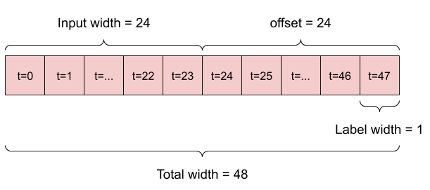

# Part 4 exam. 

The questions in your exam are based on the code and figures in this README.md file. Refer to
this file and any other file you think is useful in this repository when answering the
questions. Although you can see the code in this repository, it is **not** necessary for you to
run it. All computations have already been made, and the results are presented here. 

## Introduction
We first provide an overview of the dataset and the learning task. 

### The Dataset
In this exam, we will be using a weather dataset that contains 14 different features (i.e.,
measurements) such as air temperature, atmospheric pressure, and humidity. These were collected
every 10 minutes, beginning in 2003 and ending in 2016. To simplify the dataset, we will only
use the data after 2009 and we will only consider the hourly measurements.  This dataset was
prepared by François Chollet for his book Deep Learning with Python 

### The Learning Task 
The learning task is to predict the future weather based on past weather measurements. In
general this task involves predicting one or more weather measurements based on a certain
number of previous measurements of one or more features. 

For simplicity, we will first consider a learning task where we are only interested in
predicting the temperature for the next hour. To make this prediction, we have access to all
the previous weather measurements (e.g., temperature, pressure, humidity, etc). 

## Data cleaning and exploration
Before designing a weather prediction model, we first do some data cleaning and exploration. 
The data cleaning and exploration operations are implemented in the `data-exploration-cleaning.py` file. 

### Cleaning 
Three cleaning tasks were completed. First, erroneous wind velocity measurements were deleted.
Second, we reduced the data set to only hourly measurements after 2009. Third,
wind speed and direction was transformed into vectors. Fourth, time stamps where transformed
from a year-month-day-time format to timestamps, and new time columns where added using the
sine and cosine of the original time. This allows us to capture periodic information about the
weather (i.e., periodic changes within a day or within a year)

### Visualization
To get an idea of the data we have, we plot all data points for temperature, pressure and
humidity. 


We also plot 480 hourly data points for temperature, pressure and humidity.
 


### Dataset description 
Since it may be hard to visualize all the different types of measurements at once, we instead
use the Pandas library `describe()` function to get some descriptive statistics of the dataset.

```
           p (mbar)      T (degC)      Tpot (K)   Tdew (degC)        rh (%)  H2OC (mmol/mol)  rho (g/m**3)      wv (m/s)  max. wv (m/s)     wd (deg)
count  70091.000000  70091.000000  70091.000000  70091.000000  70091.000000     70091.000000  70091.000000  70091.000000   70091.000000 70091.000000
mean     989.212842      9.450482    283.493086      4.956471     76.009788         9.640437   1216.061232      2.130539       3.533671   174.789095
std        8.358886      8.423384      8.504424      6.730081     16.474920         4.234862     39.974263      1.543098       2.343417    86.619431
min      913.600000    -22.760000    250.850000    -24.800000     13.880000         0.810000   1059.450000      0.000000       0.000000     0.000000
25%      984.200000      3.350000    277.440000      0.240000     65.210000         6.290000   1187.470000      0.990000       1.760000   125.300000
50%      989.570000      9.410000    283.460000      5.210000     79.300000         8.960000   1213.800000      1.760000       2.980000   198.100000
75%      994.720000     15.480000    289.530000     10.080000     89.400000        12.490000   1242.765000      2.860000       4.740000   234.000000
max     1015.290000     37.280000    311.210000     23.060000    100.000000        28.740000   1393.540000     14.010000      23.500000   360.000000
```

### Data splitting
We create a training and dataset by separating the dataset into past and future data. We take
the first 70% of the measurements as the training data, and the next 30% as the testing data. 

### Data Normalization
We normalize the value of all columns to be within a small range to help with numerical
stability during training

## Data Windowing
Since our task is to predict the weather of a future time given a set number of past
measurements, we need to train the model with windows of measurements. To this end, we
implement various windowing operations. The windowing operations are implemented in the
`WindowGenerator` class inside the `windowgeneration.py` file. We test some functionality in
the `data-exploration-cleaning.py` file. 

A training sample comprises a window that is formed by a set of consecutive past
measurements, and a future measurement that is taken as the label. For example, if we want to 
forecast the weather for the next 24 hours given the previous 24 hours, we need a window of
size 48. See the figure below.  



Similarly, if we want to predict the weather for one hour given the past 6 hours, we would have
this window:


To facilitate the window formation, we implement a window generator in the
`window-generator.py` file.  The window generator finds the indices that we can then pass to
TensorFlow to form batches for training. 

The window generator also implements a method to split the window into its input and label
components. 

To test the window generator functions, we build batch of three samples, with a window of size
48, with 24 inputs, and one label, i.e., 
```
# Stack three slices, the length of the total window.
example_window = tf.stack([np.array(train_df[:w1.total_window_size]),
                           np.array(train_df[100:100+w1.total_window_size]),
                           np.array(train_df[200:200+w1.total_window_size])])
```

The output from the above code, which is implemented in line 157 of
`data-exploration-cleaning.py`, 
```
All shapes are: (batch, time, features)
Window shape: (3, 48, 19)
Inputs shape: (3, 24, 19)
Labels shape: (3, 1, 1)
```

The first index indicates we are using three sample in the batch, the second index indicates
the size of the window, and the third index indicates the number of different types of
measurements that we are using. We can see that we are using 19 measurements (14 original plus
5 that we added) each input time step. However, we are only using one measurement (i.e., the
temperature) for the label. This means we are only trying to predict one measurement and
ignoring the other 18.

We can visualize these windows as follows. We only plot the temperature measurement. We can see
the 24 inputs, an offset of 24, and then the label for the 48th hour. 


We also plot the pressure window. In this case, we only see the inputs because there is no
label to plot, i.e., we are not attempting to predict the pressure, only the temperature. 


## Dataset Generation
The `WindowGenerator` class include a `make_dataset` method that creates batches of windows that we can
use to train a model. We skip the details. 

## Prediction Models
We build increasingly more complicated prediction models. 

###  One-hour input linear model
To create a baseline, we begin by building a simple feedforward network that only uses the
temperature and all other measurements at the current moment to predict the temperature during
the next hour. The model is linear, that is, there are no activation functions. 

A conceptual diagram of this model is below:


We build and train the model in the file `linear-model.py`. A tensorflow diagram of the network
is below. 


We train the model with the following parameters:
```
linear.compile( loss=tf.keras.losses.MeanSquaredError(),
                optimizer=tf.keras.optimizers.Adam(),
                metrics=[tf.keras.metrics.MeanAbsoluteError()])
```

And the following training error and mean absolute error plots:


###  One-hour input Dense model
Before considering models, that use multiple time steps to make the prediction, we build a
non-linear single input model, which will serve for comparison purposes later on. 

The dense model's conceptual diagram is the same as for the linear model. 
The dense mode's TensorFlow diagram is as follows:


The training loss and evaluation metric plots obtained after training are as follows


### Multi-input Dense model
We are now ready to start using measurements from previous hours to make our prediction.  The
model that we use for this takes the current measurements plus two previous ones to predict the
temperature during the next hour.

Here's a  plot of three samples that can be used for training. 


The model uses a flatten layer to convert the 3 by 19 samples, into samples of 3X19=57. The
last layer reshapes the output to match the expected size, which is 1x1, not just 1. This is
important for plotting (we need the x any coordinate for the plot)

Conceptually, we can visualize this model as follows: 


We can ignore the warm-up part for now. 

The TensorFlow Diagram is as follows:


The performance plots are as follows:


### Multi-input CNN model
The CNN model add one convolutional layer to the dense model. Here's the diagram:


Conceptually, the CNN model is able to take inputs of variable lengths. 


The performance plots are as follows:


### Recurrent Neural Network
The next model uses one LSTM layer. Conceptually the LSTM layer can be viewed as giving the prediction of
the temperature for the next hour. Or as giving a prediction for every hour of the input window. We show
these two options below:


